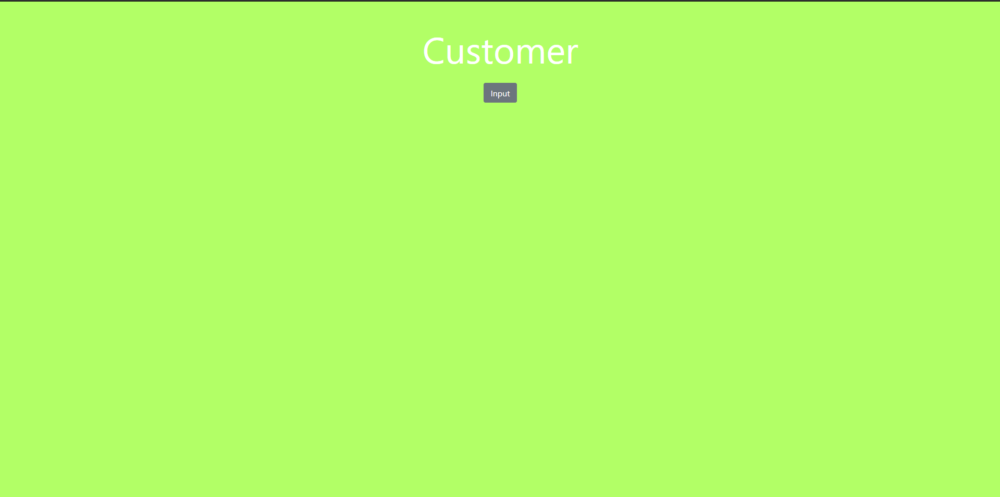
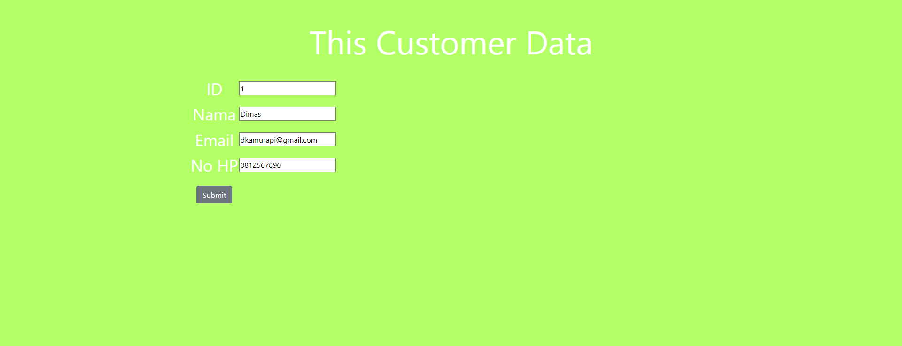

# Tugas 2 PBKK

## A. Deskripsi Singkat
- route awal membuka halaman home.jsp
- pada halaman home terdapat button untuk mengirim form customer pada controller
- controller akan mengembalikan formCustomer  dan menginisiasi kelas model Customer
- User menginputkan data namaCustomer, ID, email dan noHp
- Jika data yang diinputkan salah maka akan menampilkan halaman error
- jika data yang diinputkan sudah benar maka form akan menuju ke laman detail Customer

## B. Tampilan HomePage

## C. Tampilan Input Data

## D. Tampilan Output Data

